# CE/CZ4034 - Information Retrieval Project
*A simple search engine project done for the module CE/CZ4034 Information Retrieval in Nanyang Technological University AY2020-21 Semester 2*    
*A detailed report can be found in Report.pdf in the same repository*   
  
### Project Overview
- Introduction  
- Crawling
- Indexing and Querying  
- Classification  

### Presentation Video
Presentation Video Link: [CE/CZ4034 Information Retrieval Video Presentation](https://youtu.be/khasjY4OnBM)  
  
   
  
### Data Files
*Where all the initial data or genereated data files are stored*  
  
File Link: [Google Drive](https://drive.google.com/file/d/1HKwmMm2fs1s_ZW_1mitVDxPcfQdC6ZVY/view?usp=sharing)  

### Source Codes and Libraries 
*Where some of the libraries and miscellenous codes are stored*   
  
File Link: [Google Drive](https://drive.google.com/file/d/12CpsiGcW-tGmURcOvNDqoQDohBBbPY4B/view?usp=sharing)
  
### Saved Weights for the Classification Tasks
*A place where the saved weights of the models are stored*  
A README.txt is included in this folder to explain how and where the saved weights can be placed into the folder with the source codes.  
  
File Link: [Google Drive](https://drive.google.com/drive/folders/1zB_-cqWTy18zcnilWp6rmMattbmvGgzX?usp=sharing)

### Introduction
Singapore is a food paradise as acknowledged by many foreigners and locals. 
There are just so many food options to choose from and sometimes this might be troublesome for one to look for food options he/she wants to try on. 
As such, food review platforms provide information that update users with the comments and ratings made by other users on a particular stall or restaurant, 
hoping that the user will make an informed decision for their next meal.   
In this project, we have developed an information retrieval system for sentiment analysis on Singapore restaurant data crawled from trip-advisor. 
We first crawl our data using a python library named BeautifulSoup. Then, we use SOLR as the backend of the system to perform indexing and querying on the dataset. 
We then move on to information extraction to gain some insights on our crawled dataset. 
Afterwards, we use various deep learning approaches to do sentiment classification on the data based on a supervised learning approach and also various ways to enhance classification. 
Lastly, we implemented all of these using PySimpleGUI, a basic Graphical User Interface (GUI) to enhance user experiences.  
    
### Crawling 
we will be doing a two-level web crawling on tripadvisor’s Singapore restaurants landing page 
to get the customers’ comments, ratings, cuisines of the restaurants they have been to. 
The first level is to crawl the restaurant names, restaurant types (e.g Italian, European, Asian, Cafe etc.) 
and also the webpages that  lead to the details of the restaurants. The second level is to crawl the specific details of restaurants, 
such as the reviewer's name, ratings and comments given, based on the websites crawled in the first level.  

#### First Level Crawling
For the first level, we wrote a small test case first to crawl one set of data from the web to see if our crawling code works perfectly fine before we iterate it for multiple restaurants from multiple websites. After scrolling through a few entries, we realised that there are restaurants that were labelled as ‘sponsored’, which are repetitive as we proceed to crawl our data. Hence, we need to eliminate the ‘sponsored’ entries, which have the same tag ID as the targeted restaurant details we want to crawl, so that there will not be repeated entries. We observed that the restaurant labelled ‘sponsored’ appears after every 5 entries we want to crawl. Hence, we wrote a code to skip the crawl for every 6th instance of the data.
   
**Data we want to crawl and the sponsored tag**   
  
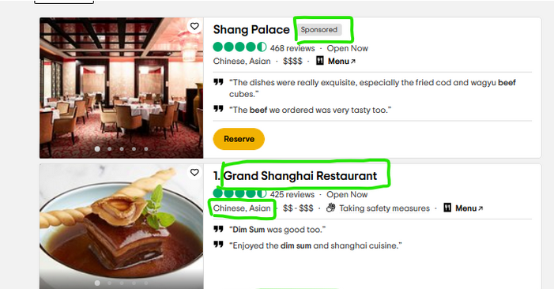   
  
**Inspecting the elements we want to crawl**  
  
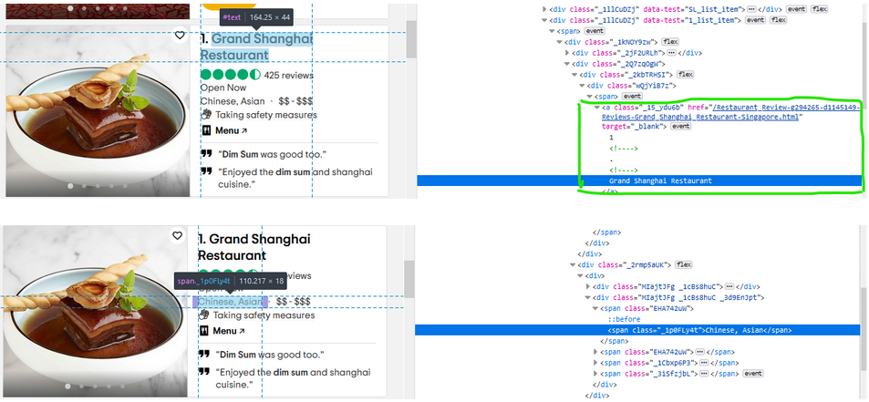   
  
**Some entries crawled (saved in a .csv file)**  
  
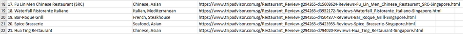  
   
#### Second Level Crawling
For the second level crawling, we will first load the .csv that was generated from the first level crawling. We then looked for the fields that we required and noted its id from the HTML tag. As such we crawled the reviewer’s name, rating and comment.  
  
We then make the program crawl iteratively through the 1013 restaurants based on the url generated from the first level crawling. We crawled 100 user data (reviewer’s name, rating and comment) from each restaurant. There may be some crawling issues along the way. As such the total number of records is less than 101300 entries.  
   
**Data we want to crawl**  
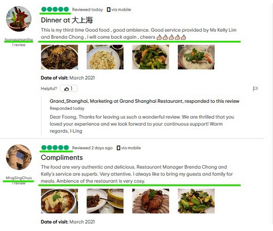   
   
**Inspecting the elements we want to crawl (second level)**  
  
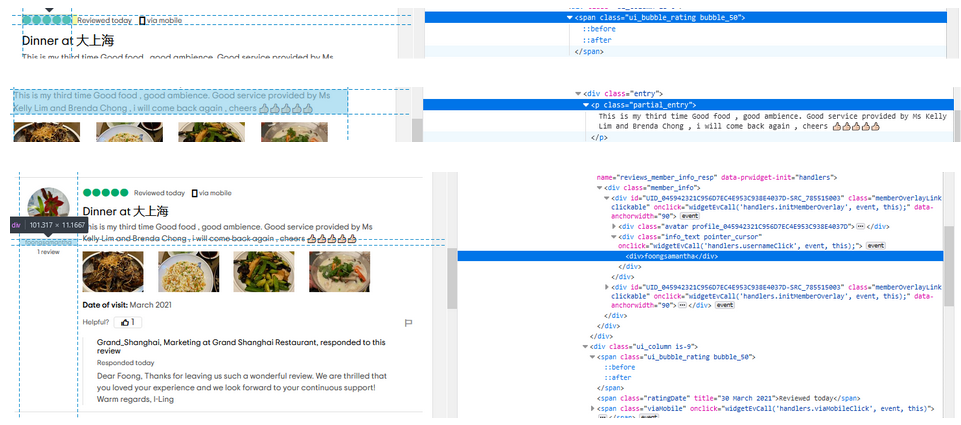 
  
**Some entries crawled for second level (saved in a .csv file)**  
  
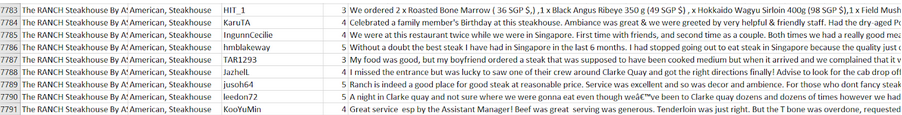  

### Indexing and Querying 
We have chosen Solr as our indexing system. Solr is an open source enterprise search platform which is written in Java. It provides full-text indexing and searching for structured and unstructured documents. REST-like API with the ability to adjust response format between XML, CSV or JSON makes it easy to integrate with other subsystems.  
Client apps can reach Solr by creating HTTP requests, then parsing the corresponding HTTP responses.   
A simple user interface was designed to illustrate the results when a query is made. PySimpleGUI is the Python package used to create our GUI. It is solely based on Tkinter.  
   
#### Introduction to Solr
Solr is a ready-to-use application, however some configurations are still required to provide better performances. In our application, we run the Solr server in standalone mode which means we only host on a single machine. We chose a schemaless implementation which Solr will automatically perform analysis on documents whenever the documentation is posted for indexing, necessary fields and field type will be created and managed by Solr. To prevent incorrect classification of data, one can predefine the fields with web admin interface or use schema API to configure schema.   
Schema include field and field type definitions. For each field, it can be configured in the field type and properties on how the data will be indexed. For the field type, it provides 3 components to configure which includes analyzer, tokenizer and list of filters which defines the text preprocessing methods. For the analyzer, it allows us to define different sets of rules to be applied for indexing or querying separately. Tokenizer defines a set of rules used to break input sequences into lexical units, for example Solr provides N-Gram Tokenizer to break input sequences into n-gram characters. After the input sequences are tokenized, a set of filters provide the rules for linguistic analysis which includes stopwords elimination, lemmatization, stemming and etc.  
  
With reference on field type declaration above, Solr web admin interface provides visual representation on how Solr performs pipelined text pre-processing based for both indexing and query.  
  
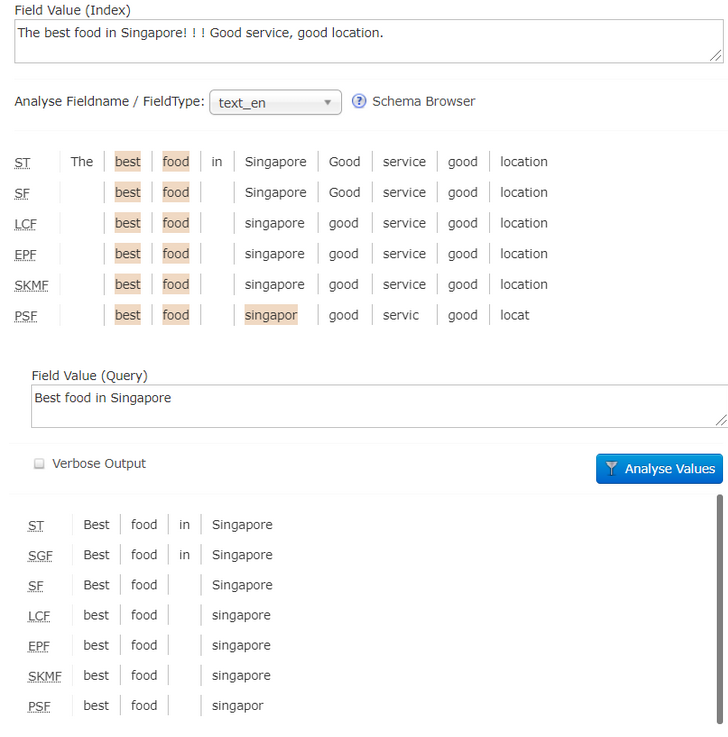  
  
#### Solr Query
In Solr web admin interface, it provides a very comprehensive query tool for us to play with querying terms with different parameters to see the effect. The table below shows a set of parameters used in our application and their purpose 
  
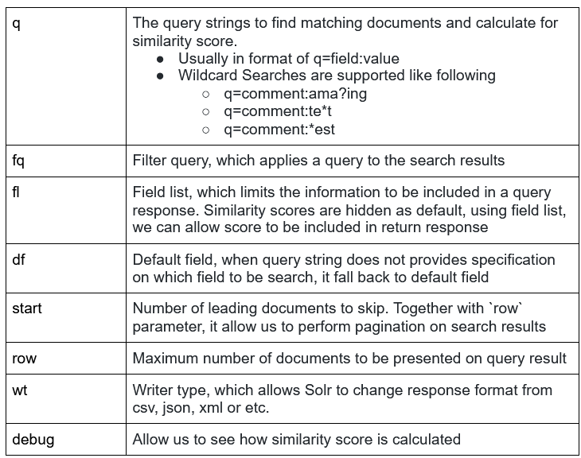   
   
#### Building a simple web interface for the search engine 
After importing the PySimpleGUI package, we create a series of widgets, which are called “Element” in PySimpleGUI, for example: Text, InputText and Button.   
All the elements created are put into a list called “layout”, after that, a “window” is created. It is the parent Element that contains all the other elements. A while loop is then created and the Window’s read() method is called to extract the events and values the user has set.   
A drop down list is created for the user to choose the function between “search”(select) and “spell check”(spell). By default, it is “search”. The selected term will be passed on to the request-handler(qt) in solr. The wt parameter in the query allows users to select an output format for the chosen API, for this assignment, JSON is selected as it is a more robust response format.A query is sent to solr by using http requests(by importing urllib) and parsing the JSON response(by importing simplejson) instead of using a client API.    
When using the application, a user can simply type the keywords in the search bar, and select the type of functions they want to perform, namely ‘search’ or ‘spell check’, where a user can use to check if there are any suggestions on the misspelled words.  
   
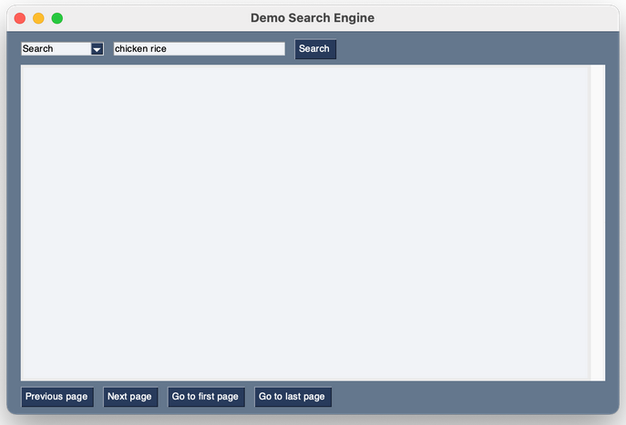  

For searching, after hitting the ‘search’ button, the results will be shown in the output box below. It will first show the number of results found in the database and the query time needed for the search. By default, it will show 10 results per page.  
For each result shown, it will contain the name of the restaurant, type of the restaurant, name of the reviewer, rating given, comment given, semantic predicted and tf/idf score.  
A user can then choose to navigate to the previous or next page, or jump to the first or last page based on their current page.  
  
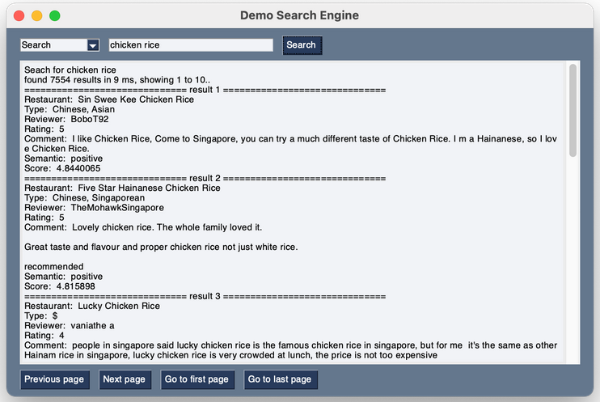  
   
For spell check usage, the user has to select ‘spell check’ from the drop down bar, type the word and click ‘search’. It will then print out the number of results found containing this keyword and its query time. Other than that, it will also print out the suggested word for correction if there exists one.   
  
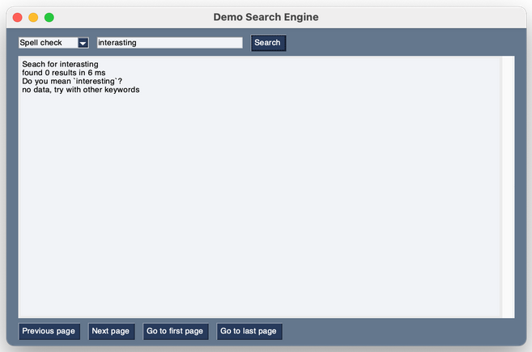   
   
