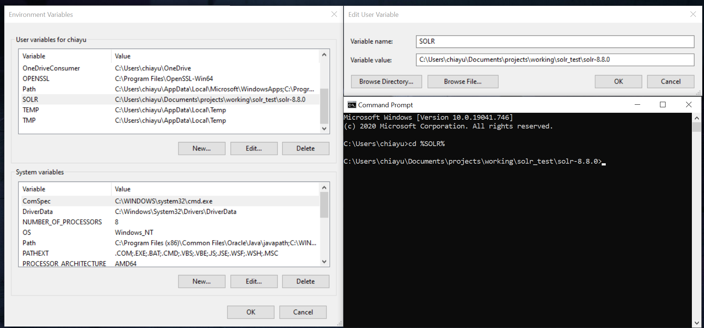
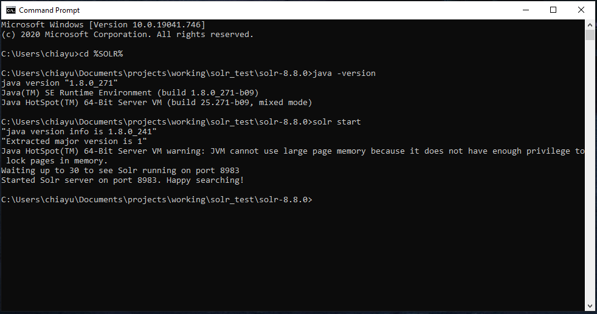
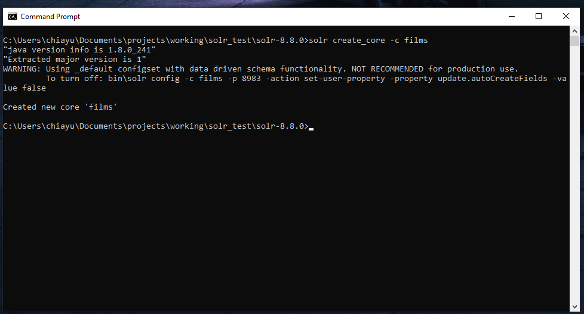
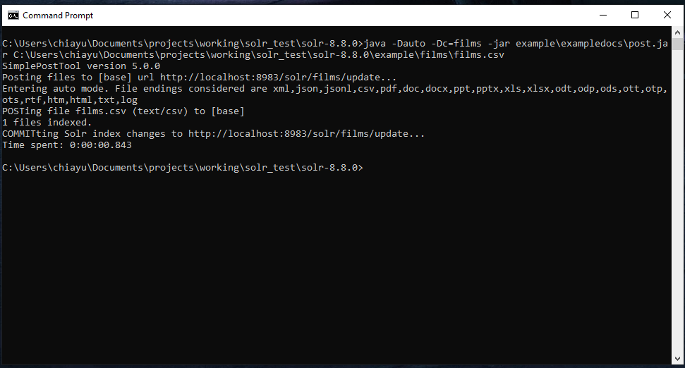

# solr_test
## Requirement ([see][1])
Java Runtime Environment (JRE) version 1.8  or higher 

## Setting up environment
* create local variable SOLR like following  
  

* putting bin folder into your path variable  

## Starting of solr server
* use command line to rediret to solr home directory
* using `solr start` to start the server
* after the server is started, enter the admin panel with url `localhost:8983\solr`
* `<solr home>\server\solr` is where we need to manage

## Creating the new core and post data into solr server
* core is used to index and keep documentation
* usually core located at `<solr home>\server\solr\<core name>`
* `<core name>\conf`: keep configurations. preprocessing relatede configuration might be adjust here
* `<core name>\data`: keep indexed data. 

## Posting of documents ([see][2])
* Mac user can use `bin\post` (Unix shell script) to post documents to solr server
* Windwos OS need to use `post.jar` (located at `<solr home>\example\exampledocs\post.jar`)

## To read up
* [schema design][3]
* [indexing][4]

[1]: https://lucene.apache.org/solr/guide/8_8/solr-system-requirements.html
[2]: https://lucene.apache.org/solr/guide/8_8/post-tool.html
[3]: https://lucene.apache.org/solr/guide/8_8/documents-fields-and-schema-design.html
[4]: https://lucene.apache.org/solr/guide/8_8/indexing-and-basic-data-operations.html
